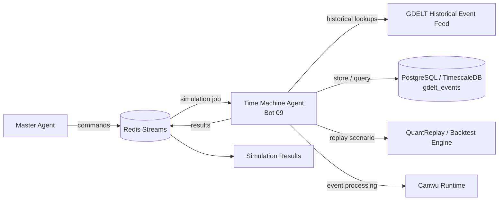

# OMEGA PRIME Architecture

This document captures the operating model for the OMEGA PRIME platform and the newly integrated Historical Time Machine & Scenario Simulation Engine.

## System Overview

The platform coordinates a master orchestration layer, decision agents, operational services, and historical replay modules. The Time Machine module expands the system from live operational intelligence into forensic, scenario-driven market and geopolitical simulation.

## Time Machine Module Diagram

## Module Responsibilities

- Historical Data Ingestor: pulls global event history from GDELT into a TimescaleDB-backed event warehouse.
- Time Machine Agent: listens for commands from the Master Agent, assembles context from historical data, and dispatches scenario simulations.
- QuantReplay: executes replay scenarios against market time series and historical regime changes.
- Canwu: provides a high-performance Rust-based execution and event processing layer for scenario orchestration.

## Execution Pattern

1. A command such as "Simulate 2018 Suez Canal blockage" is dispatched into Redis Streams.
2. Bot 09 reads the command.
3. The agent queries the GDELT event warehouse for relevant historical events.
4. The scenario is executed through QuantReplay or Backtrader.
5. Results are written back to the Redis result stream for orchestration and downstream display.

## Design Goals

- Historical realism across geopolitical and market shocks.
- Deterministic scenario replay for operational readiness.
- High-throughput orchestration without blocking the live agent loop.
